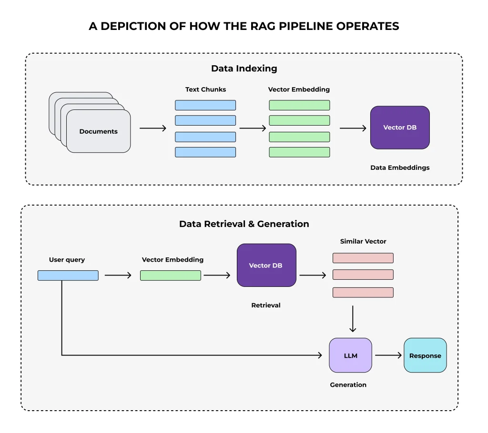

# AI4HPC



To enhance the accessibility and usability of HPC's extensive documentation and codebase, this project aims to develop a Large Language Model (LLM)-based system. This system will enable users to efficiently query and retrieve information related to the architecture, components, and development processes. By leveraging Natural Language Processing (NLP) techniques and retrieval-augmented generation (RAG), the system will provide concise and accurate answers to user queries, streamlining the learning curve for new developers and assisting experienced users in troubleshooting and optimization tasks.

## 🎯 Objectives

- **Develop an LLM-based system** capable of answering questions related to HPC platform documentation and codebase
- **Teach contributors** how to preprocess and structure unstructured documentation for efficient retrieval
- **Implement a data pipeline** that includes document crawling, parsing, chunking, embedding storage, and retrieval
- **Provide experience with tools** such as LangChain, OpenAI APIs, and vector databases
- **Allow experimentation with retrieval strategies** to optimize response accuracy and efficiency

## ⚙️ Technical Challenges

- **Crawling and parsing diverse HPC documentation sources**: The HPC platform's documentation is spread across various repositories and formats, necessitating robust crawling and parsing mechanisms
- **Chunking and embedding documents for efficient retrieval**: Breaking down large documents into manageable chunks and generating embeddings that capture semantic meaning
- **Choosing and implementing an appropriate vector database**: Selecting a database that offers efficient storage and fast search capabilities for embeddings
- **Optimizing retrieval methods**: Enhancing the relevance of responses by fine-tuning retrieval algorithms
- **Integrating an LLM using LangChain**: Seamlessly connecting the retrieval system with an LLM to generate coherent and contextually relevant answers
- **Managing API limitations**: Ensuring the system operates within API constraints and delivers responses promptly
- **Evaluating system performance and accuracy**: Establishing metrics and benchmarks to assess the system's effectiveness

## 🔧 Prerequisites

- **Knowledge of Python and Jupyter Notebooks**  The primary programming environment for development
- **Familiarity with NLP concepts and LLMs**  Understanding the fundamentals of natural language processing and large language models
- **Experience with API usage**  Particularly with OpenAI and LangChain

## 🏆 Milestones

1. **Setup Phase:**
    -  Create and configure a GitHub repository.  
    -  Install dependencies (LangChain, OpenAI API, vector database, etc.).  
    -  Set up a Jupyter Notebook template.  
2. **Data Processing Pipeline:**
    -  Develop a web/document crawler to fetch HPC documentation from suitable sources.
    -  Parse and clean the retrieved documents.  
    -  Implement a chunking mechanism for better context retrieval.  
3. **Embedding and Storage:**
    -  Convert chunks into embeddings using OpenAI or other embedding models.  
    -  Store embeddings in a vector database (e.g., ChromaDB).  
4. **Retrieval & Query Processing:**
    -  Implement retrieval methods to fetch relevant document chunks.  
    -  Use LangChain to integrate with an LLM for intelligent query answering.  
5. **Testing and Optimization:**
    -  Evaluate retrieval accuracy and optimize query responses.  
    -  Experiment with different chunking strategies and embedding models.  
6. **Final Submission:**
    -  Document findings, implementation details, and challenges.  
    -  Submit the project report and codebase.

## 📅 Timeline

| Phase                   | Start Date | End Date   |
|-------------------------|------------|------------|
| Environment Setup       | Week 1     | Week 2     |
| Data Processing Pipeline| Week 3     | Week 5     |
| Embedding & Storage     | Week 6     | Week 8     |
| Retrieval & Query Processing | Week 9 | Week 11    |
| Testing & Optimization  | Week 12    | Week 13    |
| Final Submission        | Week 14    | Week 15    |

## 🚀 Steps to Get Started

1. **Clone the repository**
    ```bash
    git clone https://github.com/pulp-platform/llm4pulp.git
    cd llm4pulp
    ```
2. **Install Dependencies**
    ```bash
    pip install -r requirements.txt
    ```
3. **Setup Jupyter Notebook**
    -  Open the provided template notebook.  
    -  Follow the instructions to preprocess documents and generate embeddings.  
4. **Develop the Data Pipeline**
    -  Implement document crawling, parsing, chunking, and embedding storage.  
5. **Integrate Query Processing**
    -  Implement retrieval strategies and integrate with LangChain & OpenAI API.  
6. **Evaluate & Optimize**
    -  Test retrieval performance and optimize the system.  
7. **Submit the Project**
    -  Document results and submit.

